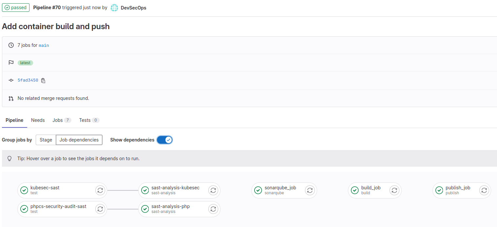
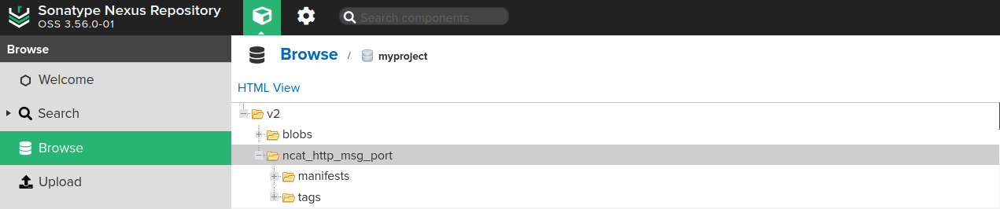

# Lab | Nexus installation, configuration and pipeline integration

In this lab you will launch Nexus container and integrate it inside the GitLab
CI pipeline, by introducing a docker build step.

## Launch Nexus

Prepare the environment on which the Nexus container will run, by creating
and assigning to the user `nexus` (with uid `200`) the `nexus` directory:

```console
> cd && mkdir -v nexus
mkdir: created directory 'nexus'

> sudo chown -v 200:200 nexus
changed ownership of 'nexus' from kirater:docker to 200:200
```

Then it will be possible to launch the Nexus instance using the
`sonatype/nexus3` container, exposing these ports (Host/Container):

- 8081:8081
- 9443:9443
- 5000:5000

```console
$ docker run --detach \
  --name nexus \
  --publish 8081:8081 \
  --publish 9443:9443 \
  --publish 5000:5000 \
  --volume $PWD/nexus:/opt/sonatype/sonatype-work \
  sonatype/nexus3
Unable to find image 'sonatype/nexus3:latest' locally
latest: Pulling from sonatype/nexus3
36c12cb044ac: Pull complete
8a1b09f0eced: Pull complete
f47ff8368d44: Pull complete
1f37eeb9a088: Pull complete
4b6419f9a540: Pull complete
cd8e246a9663: Pull complete
68721705c831: Pull complete
Digest: sha256:88044c8cdbbf1fea42b65b6c785bb88e4e2b2e96b3becd2bfce22f481216a951
Status: Downloaded newer image for sonatype/nexus3:latest
1bfde8b8401841bb82e9c00ab6e0efc90860dbbe44771e74cc13e4218d4da162
```

Check the progress until the service is `Started`:

```console
$ docker logs -f nexus
...
-------------------------------------------------

Started Sonatype Nexus OSS 3.72.0-04

-------------------------------------------------
```

Now that the working directory was populated by the initial Nexus run, the
container must be stopped:

```console
$ docker stop nexus
nexus
```

So that it will be possible to edit the `nexus/nexus3/etc/nexus.properties`
to enable `https` (you will need to use something like `sudo vim nexus/nexus3/etc/nexus.properties`)
because files are owned by a user by the uid `200`):

```console
$ cat nexus/nexus3/etc/nexus.properties
application-port-ssl=9443
nexus-args=${jetty.etc}/jetty.xml,${jetty.etc}/jetty-http.xml,${jetty.etc}/jetty-https.xml,${jetty.etc}/jetty-requestlog.xml
ssl.etc=${karaf.data}/etc/ssl
```

Create the certificate:

```console
$ sudo mkdir -v nexus/nexus3/etc/ssl
mkdir: created directory 'nexus/nexus3/etc/ssl'

$ docker run -it --rm -v $PWD/nexus/nexus3/etc/ssl:/ssl joostdecock/keytool \
  -genkeypair \
  -keystore /ssl/keystore.jks \
  -storepass password \
  -keyalg RSA \
  -keysize 2048 \
  -validity 5000 \
  -keypass password \
  -dname 'CN=172.16.99.1' \
  -ext 'SAN=IP:172.16.99.1'
...

$ sudo chown -v -R 200:200 nexus/nexus3/etc/ssl/keystore.jks
changed ownership of 'nexus/nexus3/etc/ssl/keystore.jks' from root:root to 200:200
```

And then start again the container:

```console
$ docker start nexus
nexus
```

After the start (check logs as before), get the installation password:

```console
$ sudo cat nexus/nexus3/admin.password
f76d718e-a75c-4a62-8c0a-09ca57e8a6b9
```

In this case credentials will be `admin/f76d718e-a75c-4a62-8c0a-09ca57e8a6b9`.
It is then time to complete the installation from the web ui console, by
logging at:

[http://172.16.99.1:8081](http://172.16.99.1:8081)

or

[https://172.16.99.1:9443](https://172.16.99.1:9443) (accepting the autosigned
certificate)

And complete the installation:

- Next
- Chose the new password
- Configure Anonymous Access -> Enable anonymous access
- Finish

Then, create a new docker repository by selecting the wheel icon and then
`Repository` -> `Create repository` -> `docker (hosted)` with these
specifications:

- Name: myproject
- Select `Create an HTTPS connector at specified port. Normally used if the server is behind a secure proxy.` -> 5000
- Select `Allow anonymous docker pull ( Docker Bearer Token Realm required )`

Once `Create repository` is pressed, then the docker repo will be available
at the 5000 port.

Last but not least the Docker Bearer Token needs to be activated, from the
`Security` -> `Realms` section, click on + beside the `Docker Bearer Token`
so that it becomes part of the `Active` group.

## Test credentials

Test credentials:

```console
$ docker login -u admin 172.16.99.1:5000
Password:
WARNING! Your password will be stored unencrypted in /home/rasca/.docker/config.json.
Configure a credential helper to remove this warning. See
https://docs.docker.com/engine/reference/commandline/login/#credentials-store

Login Succeeded
```

Remember to add the `172.16.99.1:5000` registry to the docker insecure
registries list under `/etc/docker/daemon.json`.
Check [DevSecOps-Pipeline-Requirements.md](DevSecOps-Pipeline-Requirements.md)
for details.

## Configure GitLab

Move to the GitLab interface in the `CI/CD Settings` of `myproject` at:

[http://172.16.99.1:8080/devsecops/myproject/-/settings/ci_cd](http://172.16.99.1:8080/devsecops/myproject/-/settings/ci_cd)

Click `Expand` button of the `Variables` section and add:

- `NEXUS_HOST`: 172.16.99.1:5000
- `NEXUS_USERNAME`: admin
- `NEXUS_PASSWORD`: admin123

The `NEXUS_HOST` refers to the IP of the docker host, check
[DevSecOps-Pipeline-Requirements.md](DevSecOps-Pipeline-Requirements.md) to find out how to get it.

Ensure that for the `NEXUS_PASSWORD` variable the `Mask variable` option is
selected.

## Container build

Create a `Dockerfile` inside `myproject` with these contents:

```dockerfile
FROM busybox

ENV NCAT_MESSAGE "Container test"
ENV NCAT_HEADER "HTTP/1.1 200 OK"
ENV NCAT_PORT "8888"

RUN addgroup -S nonroot && \
    adduser -S nonroot -G nonroot

USER nonroot

CMD /bin/nc -l -k -p ${NCAT_PORT} -e /bin/echo -e "${NCAT_HEADER}\n\n${NCAT_MESSAGE}"
```

Add the build process to the pipeline adding to `.gitlab-ci.yml` this code:

```yaml
variables:
  ...
  DOCKER_IMAGE_NAME: ncat_http_msg_port

stages:
  ...
  - build
  - publish

...

build_job:
  stage: build
  script:
    - echo "Building myproject"
    - docker build -t ${DOCKER_IMAGE_NAME} .

publish_job:
  stage: publish
  script:
    - echo "Publishing image to Nexus Repository..."
    - docker login -u ${NEXUS_USERNAME} -p ${NEXUS_PASSWORD} ${NEXUS_HOST}
    - docker tag ${DOCKER_IMAGE_NAME}:latest ${NEXUS_HOST}/${DOCKER_IMAGE_NAME}:latest
    - docker push ${NEXUS_HOST}/${DOCKER_IMAGE_NAME}:latest
  only:
    - main
```

Commit and push the changes:

```console
$ git add . && git commit -m "Add container build and push"
[main 113b719] Add container build and push
 2 files changed, 31 insertions(+)
 create mode 100644 Dockerfile

$ git push
Enumerating objects: 6, done.
Counting objects: 100% (6/6), done.
Delta compression using up to 8 threads
Compressing objects: 100% (4/4), done.
Writing objects: 100% (4/4), 874 bytes | 874.00 KiB/s, done.
Total 4 (delta 1), reused 0 (delta 0), pack-reused 0
To ssh://172.16.99.1:2222/devsecops/myproject.git
   855bfab..113b719  main -> main
[kirater@training-adm myproject]$ git status
On branch main
Your branch is up to date with 'origin/main'.

nothing to commit, working tree clean
```

And then follow the progress from the GitLab interface:



The final result should be the presence of the image inside the Nexus
interface:


