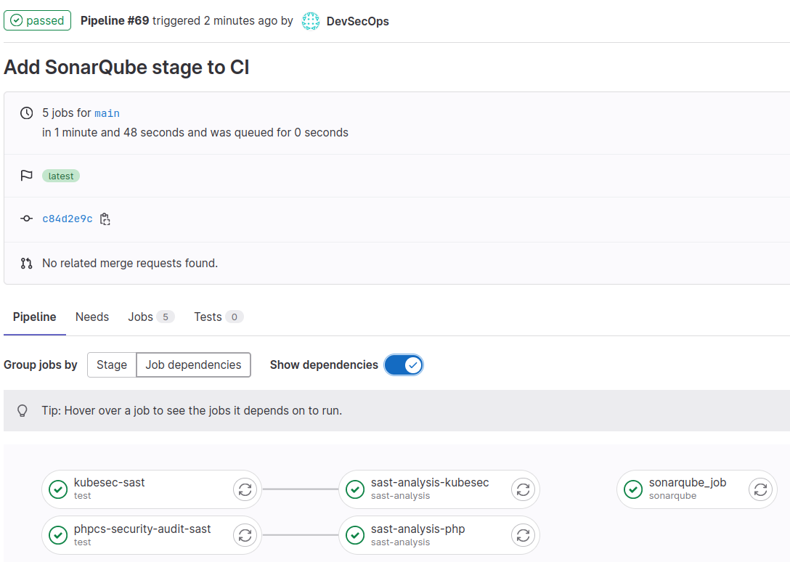

# Lab | Install SonarQube and integrate it inside a GitLab pipeline

## Launch SonarQube

Launch the SonarQube instance using the `sonarqube:latest` container image,
exposing these ports (Host/Container):

- 9000:9000

```console
> cd ~

> docker run --detach \
  --name sonarqube \
  --publish 9000:9000 \
  sonarqube:lts
```

Check the progresses, until the web interface comes up:

```console
> docker logs -f sonarqube
2023.06.20 14:36:58 INFO  app[][o.s.a.AppFileSystem] Cleaning or creating temp directory /opt/sonarqube/temp
2023.06.20 14:36:58 INFO  app[][o.s.a.es.EsSettings] Elasticsearch listening on [HTTP: 127.0.0.1:9001, TCP: 127.0.0.1:38019]
...
2023.06.20 14:37:33 INFO  app[][o.s.a.SchedulerImpl] SonarQube is operational
...
```

## Configure SonarQube

Log into SonarQube interface by using `admin`/`admin` credentials at [http://172.16.99.1:9000](http://172.16.99.1:9000)
and the admin password as requested.

Select the users section at [http://172.16.99.1:9000/admin/users](http://172.16.99.1:9000/admin/users)
and under "Tokens" click in the icon.

Create a token named "GitLab" leaving "30 days" as "Expires in" and take note
of the value, which will be something like `squ_a37f1d4c60b980cb91fb5d4fb878d2b96be2ecb5`.

## Configure GitLab

Move to the GitLab interface in the `CI/CD Settings` of `myproject` at:

[http://172.16.99.1:8080/devsecops/myproject/-/settings/ci_cd](http://172.16.99.1:8080/devsecops/myproject/-/settings/ci_cd)

Click `Expand` button of the `Variables` section, and add:

- `SONAR_HOST_URL`: `http://172.16.99.1:9000`
- `SONAR_TOKEN`: `squ_a37f1d4c60b980cb91fb5d4fb878d2b96be2ecb5`

The `SONAR_HOST_URL` refers to the IP of the docker host, check
[DevSecOps-Pipeline-Requirements.md](DevSecOps-Pipeline-Requirements.md) to find out how to get it.

Ensure that for the `SONAR_TOKEN` variable the `Mask variable` option is
selected.

## Modify pipeline to add SonarQube

Modify the CI lab of `myproject` by involving Sonarqube, adding this content
to `.gitlab-ci.yml`:

```yaml
stages:
  ...
  - sonarqube

...

sonarqube_job:
  stage: sonarqube
  image: sonarsource/sonar-scanner-cli:latest
  script:
    - sonar-scanner
      -Dsonar.host.url=${SONAR_HOST_URL}
      -Dsonar.token=${SONAR_TOKEN}
      -Dsonar.projectKey=myproject
  only:
    - main
```

Commit and push the change:

```console
> git add . && git commit -m "Add SonarQube stage to CI"
[main 682a9b482669] Add SonarQube stage to CI
 1 file changed, 12 insertions(+)
 create mode 100644 .gitlab-ci.yml

> git push
```

And then follow the progress from the GitLab interface, under the CI
pipelines a new stage should be visible:



The project `myproject` will now be visible also in the Sonarqube web
interface.
