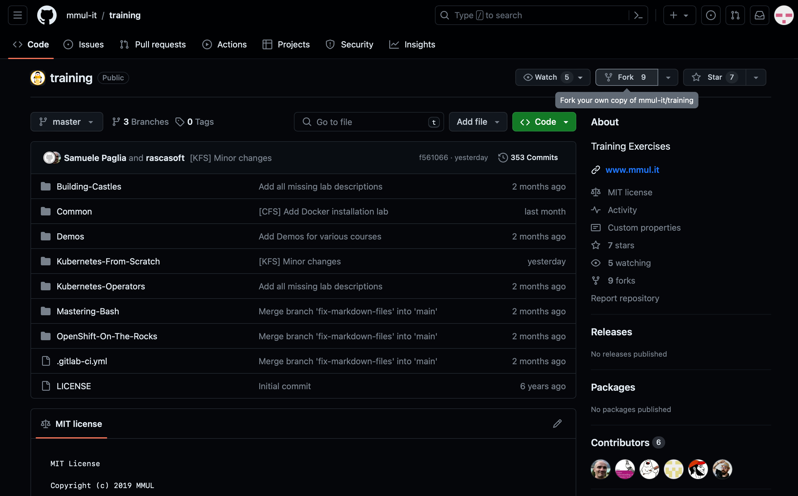
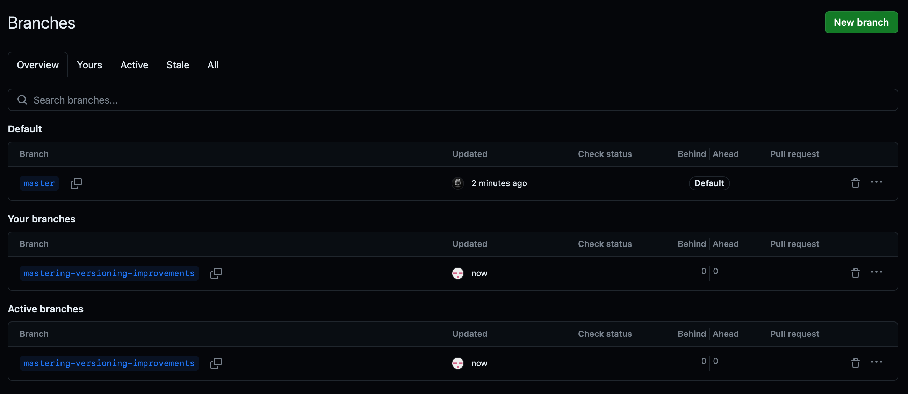
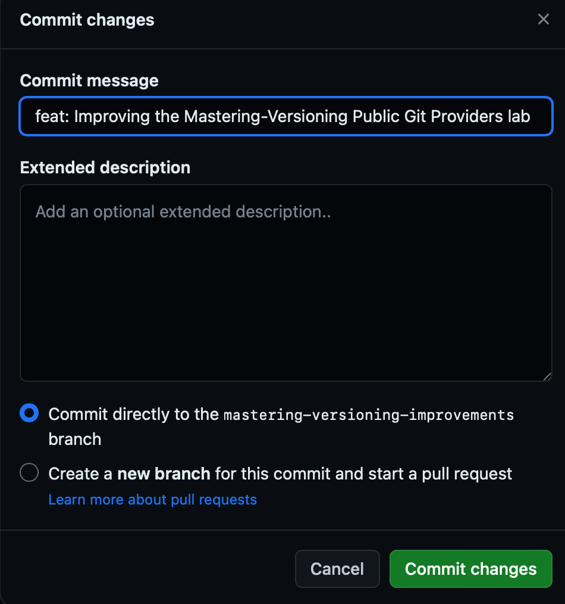
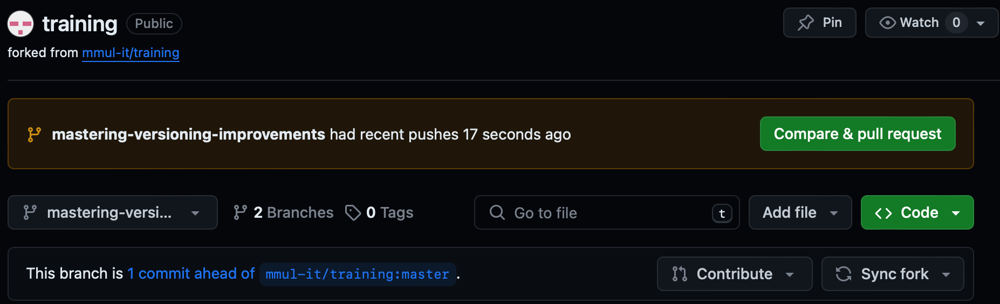
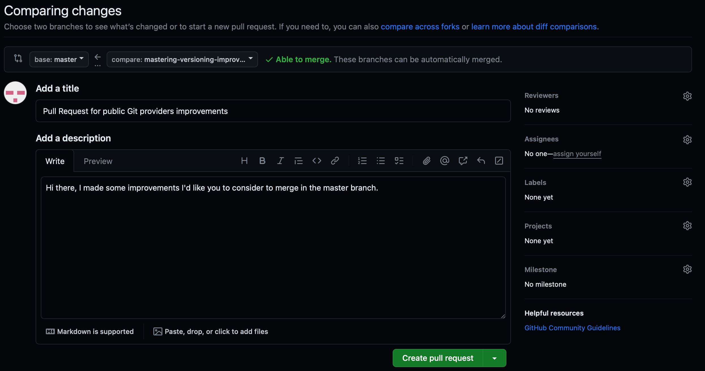
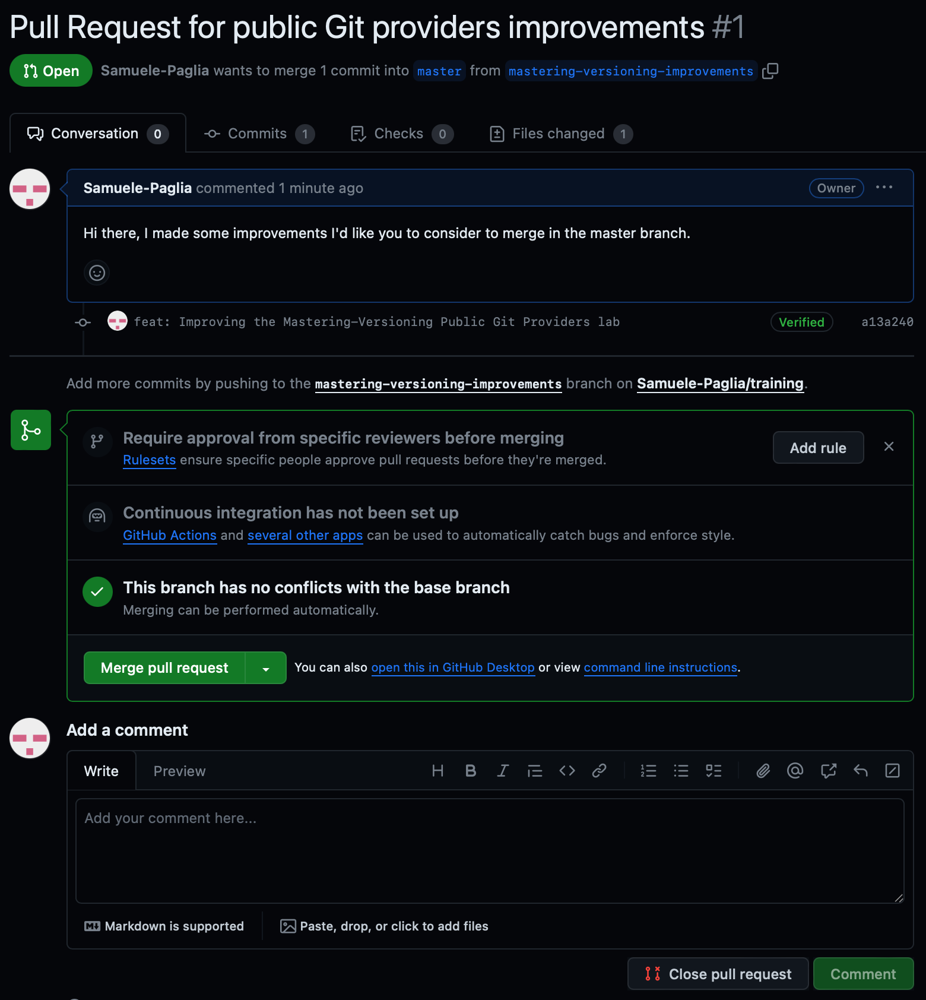
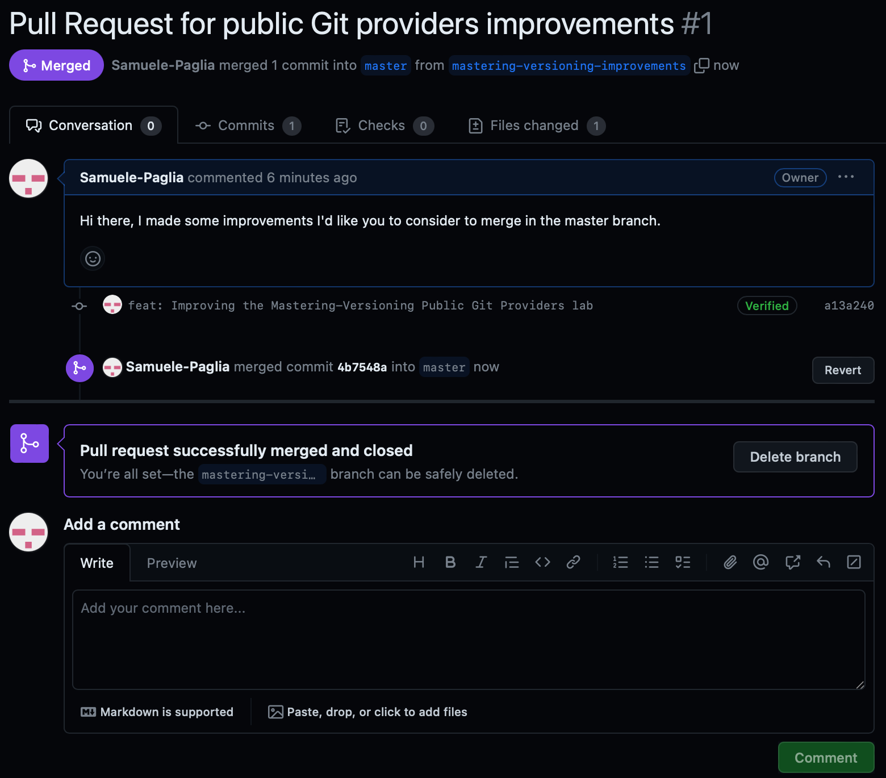
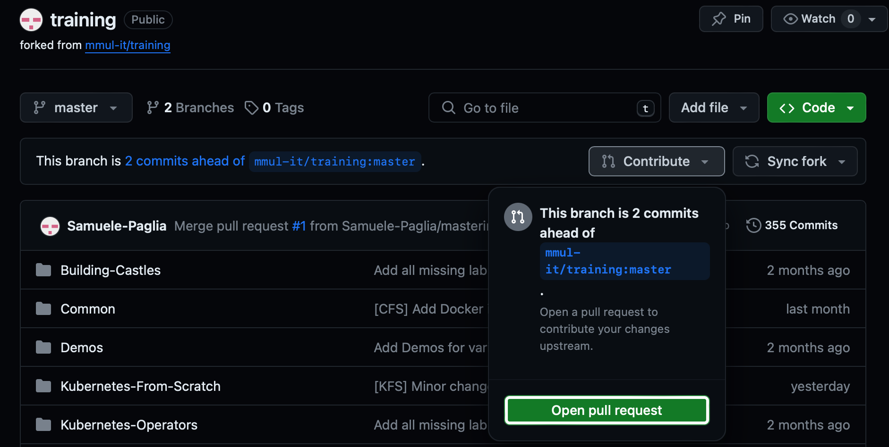

# Lab | Play with GitHub and pull requests

In this lab you will:

1. Fork the current repository used for labs.
2. Create a new feature branch named `mastering-versioning-improvements`.
3. Using the GitHub UI, make same changes to the current file
   `training/Mastering-Versioning/Git-Public-Providers.md`
   pushing them on the branch we've previously created.
4. Create a pull request in order to ask for merging the
   feature branch into the `master`.
5. Approve the pull request introducing the improvements.
6. Note that we could open a pull request in order to contribute
   to the repository we forked from.

## Solution

1. Forking the current repository we'll obtain a copy of it in our GitHub
   account. In this way we can perform any changes we want to:

   

   

2. Instead of pushing directly to the `master` branch, we create a feature
   branch, `mastering-versioning-improvements`, where we'll do all the changes:

   

3. The GitHub UI allows us to perform changes to the code in a easy way:

   

4. After pushing, GitHub will let us know about the recent action giving
   the possibility to compare branches and open a pull request:

   

   

   After opening the pull request it will appear as follow:

   

5. After viewing the changes, who is responsible for the master branch (ourself,
   in this example case) can approve the pull request, merging the feature
   branch into the `master`.
   
   

6. In the same way we opened a pull request in our repository, we can do the
   same but for the repository we forked from. This enables contributions to
   projects in which we don't have permissions to operate directly with the
   repository:

   
