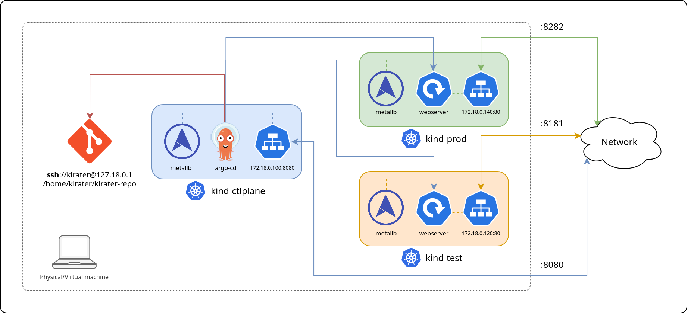

# Argo CD Workshop

## Environment architecture

The overall architecture of this workshop project is described in the following
image:

Everything is meant to be created on a physical machine or a virtual one (when
using Linux and QEMU/KVM remember to enable [host-passthrough](https://qemu-project.gitlab.io/qemu/system/qemu-cpu-models.html#libvirt-guest-xml)),
that will run the main Git repository for the application and the three
Kubernetes sample clusters.

Hardware requirements for the physical machine are, *at least*, 4 CPU and 8
Gigabytes of RAM. 8 CPU and 16 Gigabytes of RAM will be ideal.

Software requirements for the main machine are essentially just the Docker
service, everything else will be covered in the various stages.

The outputs reported in the various stages were taken from a [AlmaLinux 9](https://repo.almalinux.org/almalinux/9/cloud/x86_64/images/AlmaLinux-9-GenericCloud-latest.x86_64.qcow2)
virtual machine with 8 CPUs and 32 Gigabytes of RAM.

## Workshop structure

The structure of the workshop will be based on stages:

- Stage 1: [Kubernetes clusters installation](Stage-1-K8S-Installation.md).
- Stage 2: [MetalLB installation and configuration](Stage-2-MetalLB-Installation.md).
- Stage 3: [Argo-CD installation and configuration](Stage-3-Argo-CD-Installation.md).
- Stage 4: [Argo-CD application tests](Stage-4-Argo-CD-Application-Test.md).

## References

There are several technologies covered in this workshop, the main ones are
listed here:

- [Kubernetes](https://kubernetes.io/) also known as K8s, is an open-source
system for automating deployment, scaling, and management of containerized
applications.
- [Kind](https://kind.sigs.k8s.io/) a tool for running local Kubernetes
clusters using Docker container "nodes".
- [kubectl](https://kubernetes.io/docs/tasks/tools/install-kubectl-linux/) the
Kubernetes command-line tool.
- [MetalLB](https://metallb.universe.tf/) a bare metal load balancer for
Kubernetes.
- [Argo CD](https://argo-cd.readthedocs.io/) a declarative GitOps CD for
Kubernetes.

## Author

Raoul Scarazzini ([raoul.scarazzini@kiratech.it](mailto:raoul.scarazzini@kiratech.it))
