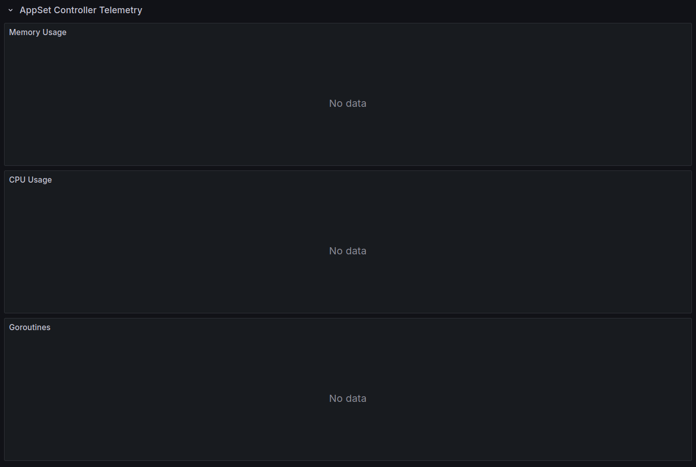
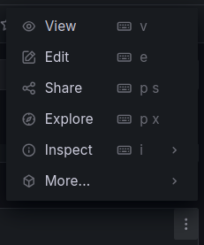
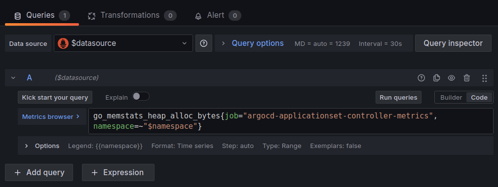
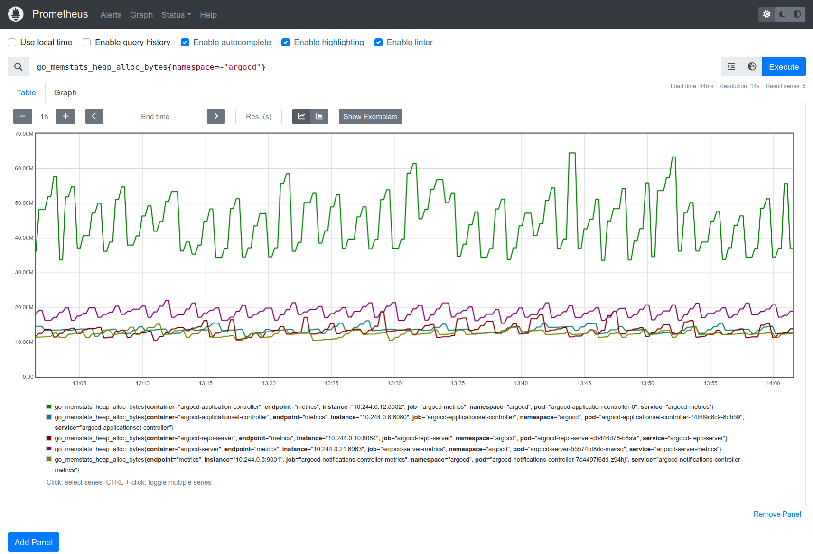
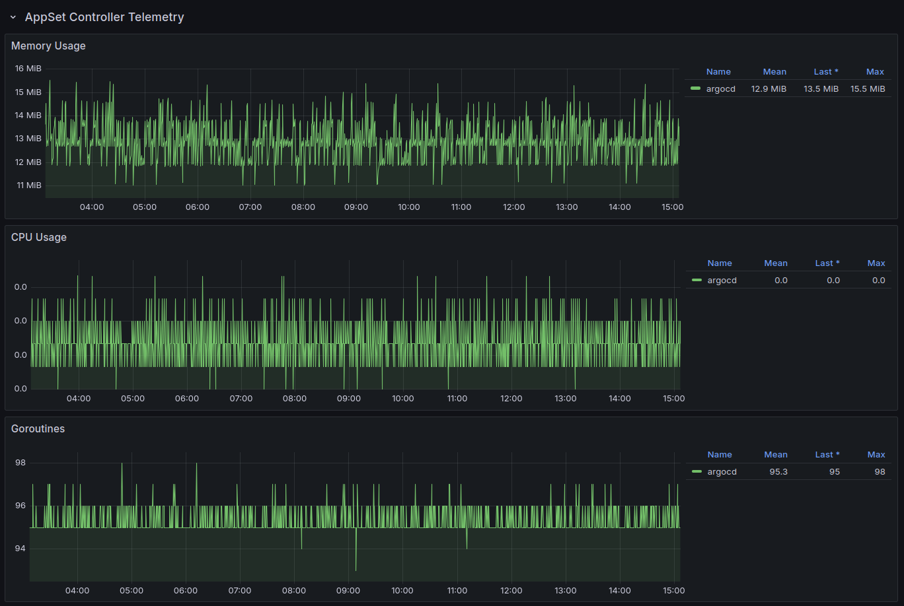

# Argo CD Workshop - Metrics configuration

This bonus stage installs and enables Prometheus and Grafana metrics so to
configure a specific Argo CD Grafana dashboard.

## Enable monitoring

The metrics infrastructure of Prometheus and Grafana is easily installable using
the specific Helm chart.

To install Helm:

```console
$ curl -o helm.tar.gz https://get.helm.sh/helm-v3.13.2-linux-amd64.tar.gz
  % Total    % Received % Xferd  Average Speed   Time    Time     Time  Current
                                 Dload  Upload   Total   Spent    Left  Speed
100 15.4M  100 15.4M    0     0  12.7M      0  0:00:01  0:00:01 --:--:-- 12.7M

$ tar -xvf helm.tar.gz
linux-amd64/
linux-amd64/helm
linux-amd64/LICENSE
linux-amd64/README.md

$ sudo mv -v linux-amd64/helm /usr/local/bin/helm
renamed 'linux-amd64/helm' -> '/usr/local/bin/helm'

$ helm version
version.BuildInfo{Version:"v3.13.2", GitCommit:"2a2fb3b98829f1e0be6fb18af2f6599e0f4e8243", GitTreeState:"clean", GoVersion:"go1.20.10"}
```

Once Helm is available, installing Prometheus is easy:

```console
$ helm repo add prometheus-community https://prometheus-community.github.io/helm-charts
"prometheus-community" has been added to your repositories

$ helm repo update
Hang tight while we grab the latest from your chart repositories...
...Successfully got an update from the "prometheus-community" chart repository
Update Complete. ⎈Happy Helming!⎈

$ helm install prometheus prometheus-community/kube-prometheus-stack \
    --namespace monitoring --create-namespace
NAME: prometheus
LAST DEPLOYED: Thu Nov 14 15:31:27 2024
NAMESPACE: monitoring
STATUS: deployed
REVISION: 1
NOTES:
kube-prometheus-stack has been installed. Check its status by running:
  kubectl --namespace monitoring get pods -l "release=prometheus"

Visit https://github.com/prometheus-operator/kube-prometheus for instructions on how to create & configure Alertmanager and Prometheus instances using the Operator.
```

To expose and access the Grafana web interface a new service will be created:

```console
$ kubectl --namespace monitoring expose deployment prometheus-grafana \
    --type=LoadBalancer \
    --name=prometheus-grafana-lb
service/prometheus-grafana-lb exposed

$ kubectl --namespace monitoring get services prometheus-grafana-lb
NAME                    TYPE           CLUSTER-IP     EXTERNAL-IP    PORT(S)                                        AGE
prometheus-grafana-lb   LoadBalancer   10.96.60.180   172.18.0.101   3000:32167/TCP,9094:30744/TCP,9094:30744/UDP   26s
```

The `admin` user password can be retrieved inside the `prometheus-grafana`
secret:

```console
$ kubectl --namespace monitoring get secret prometheus-grafana \
    -o jsonpath="{.data.admin-password}" | base64 --decode ; echo
prom-operator
```

Before accessing the Grafana interface, the specific Prometheus `ServiceMonitor`
resources must be created.

These can be retrieved from the [Argo CD official documentation](https://argo-cd.readthedocs.io/en/stable/operator-manual/metrics/#prometheus-operator),
and can be saved inside a specific yaml file with these contents:

```yaml
apiVersion: monitoring.coreos.com/v1
kind: ServiceMonitor
metadata:
  namespace: argocd
  name: argocd-metrics
  labels:
    release: prometheus
spec:
  selector:
    matchLabels:
      app.kubernetes.io/name: argocd-metrics
  endpoints:
  - port: metrics
---
apiVersion: monitoring.coreos.com/v1
kind: ServiceMonitor
metadata:
  namespace: argocd
  name: argocd-server-metrics
  labels:
    release: prometheus
spec:
  selector:
    matchLabels:
      app.kubernetes.io/name: argocd-server-metrics
  endpoints:
  - port: metrics
---
apiVersion: monitoring.coreos.com/v1
kind: ServiceMonitor
metadata:
  namespace: argocd
  name: argocd-repo-server-metrics
  labels:
    release: prometheus
spec:
  selector:
    matchLabels:
      app.kubernetes.io/name: argocd-repo-server
  endpoints:
  - port: metrics
---
apiVersion: monitoring.coreos.com/v1
kind: ServiceMonitor
metadata:
  namespace: argocd
  name: argocd-applicationset-controller-metrics
  labels:
    release: prometheus
spec:
  selector:
    matchLabels:
      app.kubernetes.io/name: argocd-applicationset-controller
  endpoints:
  - port: metrics
---
apiVersion: monitoring.coreos.com/v1
kind: ServiceMonitor
metadata:
  namespace: argocd
  name: argocd-dex-server
  labels:
    release: prometheus
spec:
  selector:
    matchLabels:
      app.kubernetes.io/name: argocd-dex-server
  endpoints:
    - port: metrics
---
apiVersion: monitoring.coreos.com/v1
kind: ServiceMonitor
metadata:
  namespace: argocd
  name: argocd-redis-haproxy-metrics
  labels:
    release: prometheus
spec:
  selector:
    matchLabels:
      app.kubernetes.io/name: argocd-redis-ha-haproxy
  endpoints:
  - port: http-exporter-port
---
apiVersion: monitoring.coreos.com/v1
kind: ServiceMonitor
metadata:
  namespace: argocd
  name: argocd-notifications-controller
  labels:
    release: prometheus
spec:
  selector:
    matchLabels:
      app.kubernetes.io/name: argocd-notifications-controller-metrics
  endpoints:
    - port: metrics
```

To apply them:

```console
$ kubectl apply -f argo-metrics.yaml
servicemonitor.monitoring.coreos.com/argocd-metrics configured
servicemonitor.monitoring.coreos.com/argocd-server-metrics configured
servicemonitor.monitoring.coreos.com/argocd-repo-server-metrics configured
servicemonitor.monitoring.coreos.com/argocd-applicationset-controller-metrics configured
servicemonitor.monitoring.coreos.com/argocd-dex-server configured
servicemonitor.monitoring.coreos.com/argocd-redis-haproxy-metrics configured
servicemonitor.monitoring.coreos.com/argocd-notifications-controller configured
```

It is now time to access Grafana. Once logged in, to import an ArgoCD Grafana
Dashboard, pick [https://github.com/argoproj/argo-cd/blob/master/examples/dashboard.json](https://github.com/argoproj/argo-cd/blob/master/examples/dashboard.json)
amd import the dashboard by opening Grafana at [http://172.18.0.101:3000](http://172.18.0.101:3000).

Then go to `Dashboards` > `New` > `Import` and paste the JSON file into the text
area and press `Load`.

After importing, you should see metrics and visualizations for ArgoCD, including
sync status, application health, and operational metrics, on your new dashboard.

### Troubleshooting Grafana Dashboard

It could happen that some of the boxes related to the Argo CD stats will contain
a "No data" content.

This can happen because there are effectively no data (i.e. `Sync Failures`
will be empty if there were no application synchronization failures), but in
other cases the query associated to the box is not getting results.

Let's take the `AppSet Controller Telemetry`, which initially could be something
like this:



To understand the query it is possible to click on the top right three dots, and
select "Edit":



In this case the `Metrics browser` shows:



So the query is:

```prometheus
go_memstats_heap_alloc_bytes{job="argocd-applicationset-controller-metrics",namespace=~"$namespace"}
```

To check if it's valid we need to have a look at the Prometheus metrics, by
first exposing the web interface, as follows:

```console
$ kubectl --namespace monitoring expose service prometheus-operated \
    --type=LoadBalancer \
    --name prometheus-operated-lb
service/prometheus-operated-lb exposed
```

This will produce an IP listening on the `9090` port:

```console
$ kubectl --namespace monitoring get services prometheus-operated-lb
NAME                     TYPE           CLUSTER-IP      EXTERNAL-IP    PORT(S)          AGE
prometheus-operated-lb   LoadBalancer   10.96.158.174   172.18.0.102   9090:31254/TCP   4h53m
```

The interface will show an input box in which the query should be specified.

As we verified the original query in not getting results, so we need to keep it
more general, for example by specifying just the `namespace=~"argocd"`
parameter, as follows:

```prometheus
go_memstats_heap_alloc_bytes{namespace=~"argocd"}
```

Hitting execute and moving in the `Graph` tab will show some output:



From here we can learn that the correct job name is not `argocd-applicationset-controller-metrics',
but instead `argocd-applicationset-controller`.

Fixing the value all over the Grafana Dashboard will make appear in short all
the missing graphs:



This debug sequence can be applied to any missing metrics/graph.
