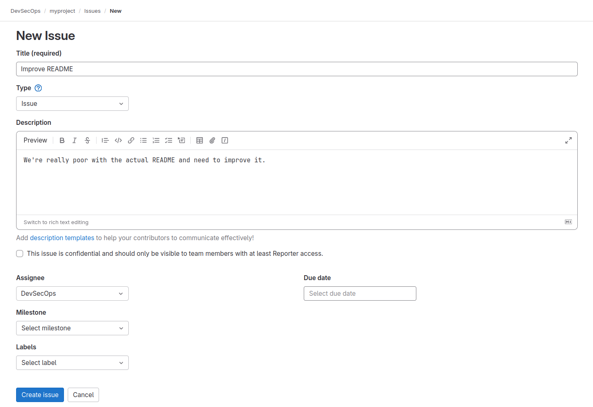
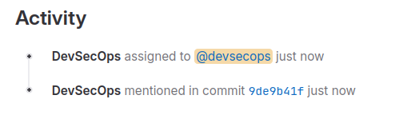
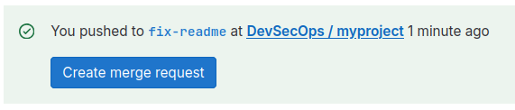
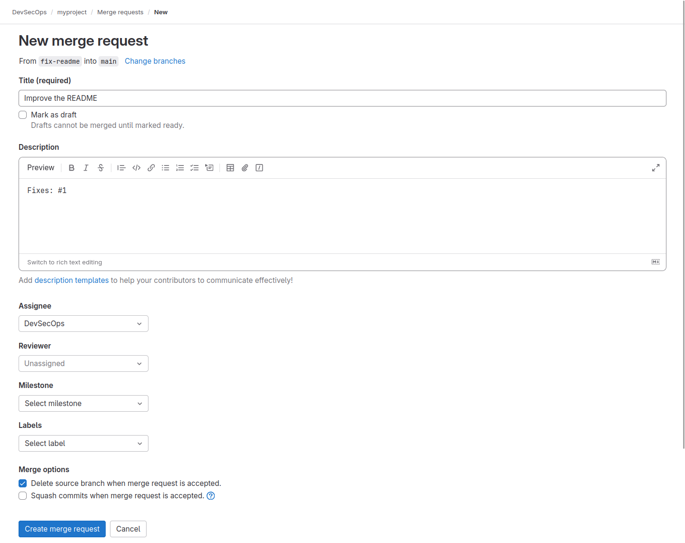
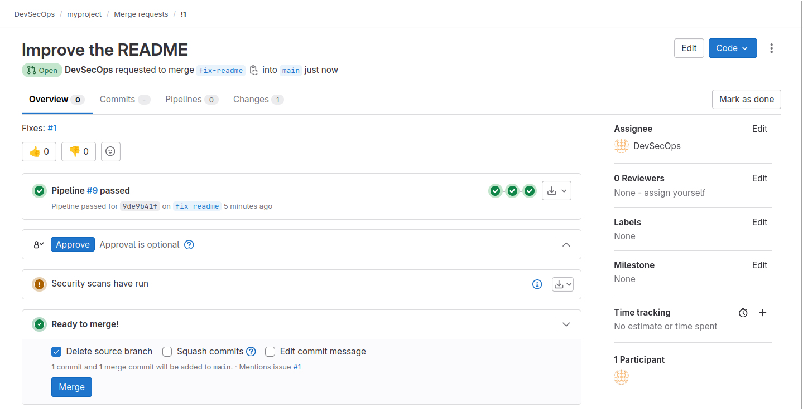

# How to solve an issue using a commit

## Create and assign a new issue

A GitLab issue is easily opened by using the interface. Just go under `Plan`
then `Issues` and click "New issue".

Issue must have a `Title` and a `Description`, and can be assigned to a GitLab
user, as in this image:



It can also have a `Due date`, a `Milestone` and `Labels`.

Once `Create issue` is pressed the issue is created, and an ID number is
assigned.

It is visible from the Issue page itself:


## Resolve the issue using a commit

Issue can be manually managed, but a better approach is to use commit to fix
them.

The usual workflow will be to create a new local Git branch and put in there
the changes:

```console
$ pwd
/home/kirater/myproject

$ git checkout -b fix-readme
Switched to a new branch 'fix-readme'

$ echo "This is a new and improved version of the README" > README.md
(no output)
```

Now what does the trick is the usage of the specific `Fixes` keyword inside the
second commit message which will be the "body" of our commit (and can also be
modified using `git commit --amend`:

```console
$ git add . && git commit -m "Improve the README" -m "Fixes: #1"
[fix-readme 9de9b41] Improve the README
 1 file changed, 1 insertion(+), 1 deletion(-)
```

To push the new branch use:

```console
$ git push --set-upstream origin fix-readme
Enumerating objects: 5, done.
Counting objects: 100% (5/5), done.
Delta compression using up to 8 threads
Compressing objects: 100% (2/2), done.
Writing objects: 100% (3/3), 319 bytes | 319.00 KiB/s, done.
Total 3 (delta 1), reused 0 (delta 0), pack-reused 0
remote:
remote: To create a merge request for fix-readme, visit:
remote:   http://00088a0c20f8/devsecops/myproject/-/merge_requests/new?merge_request%5Bsource_branch%5D=fix-readme
remote:
To ssh://172.16.99.1:2222/devsecops/myproject.git
 * [new branch]      fix-readme -> fix-readme
branch 'fix-readme' set up to track 'origin/fix-readme'.
```

This will produce a change on the Issue:



If everything is fine, it is time to create a merge request.

## Merge the modification to close the issue

By looking at the top of the project main page something else has changed:



Pressing the button will automate the merge request creation:



And by pressing "Create merge request" it will be possible to complete the
process:



From here it will be a matter of just pressing "Merge".

The process will complete, the issue will be closed and to make it part of the
local repo a new pull from the main branch will be made:

```console
$ git checkout main
Switched to branch 'main'
Your branch is up to date with 'origin/main'.

$ git pull
remote: Enumerating objects: 1, done.
remote: Counting objects: 100% (1/1), done.
remote: Total 1 (delta 0), reused 0 (delta 0), pack-reused 0
Unpacking objects: 100% (1/1), 269 bytes | 269.00 KiB/s, done.
From ssh://172.16.99.1:2222/devsecops/myproject
   00f0947..73354b1  main       -> origin/main
Updating 00f0947..73354b1
Fast-forward
 README.md | 2 +-
 1 file changed, 1 insertion(+), 1 deletion(-)
```

And everything will be in its right place.
