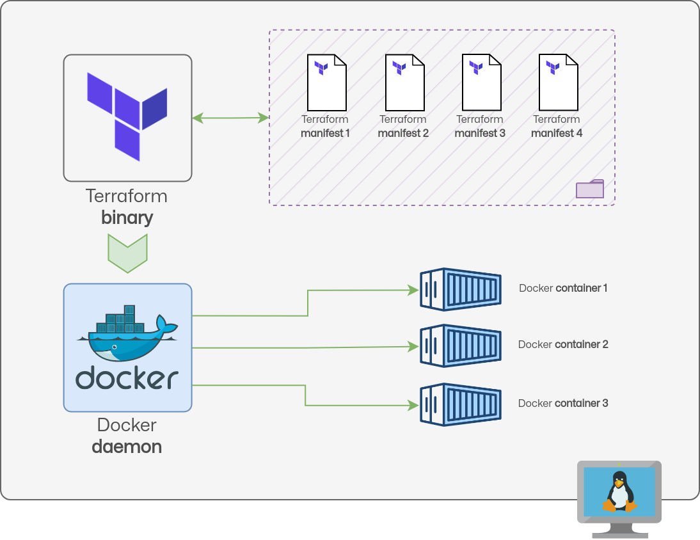

# Terraform Workshop

## Environment architecture

The overall architecture of this workshop project is composed by a single
machine in which all the tools will be installed:

Everything is meant to be created on a physical machine or a virtual one.

Hardware requirements for the physical machine are, *at least*, 2 CPU and 4
Gigabytes of RAM.

Software requirements for the main machine are essentially just the Docker
service and the Terraform executable, everything will be covered in the various
stages.

The outputs reported in the various stages were taken from a [AlmaLinux 9](https://repo.almalinux.org/almalinux/9/cloud/x86_64/images/AlmaLinux-9-GenericCloud-latest.x86_64.qcow2)
virtual machine with 4 CPUs and 8 Gigabytes of RAM.

## Workshop structure

The structure of the workshop will be based on these stages:

- Stage 1: [A Terraform recap with multi choice quiz](../../IaC-From-Scratch/Terraform-Multiple-Choice-Quiz.md).
- Stage 2: [First Manifest](../../IaC-From-Scratch/Terraform-First-Manifest.md).
- Stage 3: [Using variables](../../IaC-From-Scratch/Terraform-Manifest-With-Vars.md).
- Stage 4: [Writing a custom module](../../IaC-From-Scratch/Terraform-Custom-Module.md).
- Stage 5: [Using linter to ensure code quality](../../IaC-From-Scratch/Terraform-Fix-Linter-Issues.md).
- Bonus stage: [The TFs generator project](https://github.com/mmul-it/tfs_generator).

## References

There are several technologies covered in this workshop, the main ones are
listed here:

- [Terraform](https://www.terraform.io/) Infrastructure automation to provision
  and manage resources in any cloud or data center..
- [Docker](https://www.docker.com/) Tool to build, share, run, and verify
  applications anywhere without environment configuration or management.

## Author

Raoul Scarazzini ([raoul.scarazzini@kiratech.it](mailto:raoul.scarazzini@kiratech.it))
